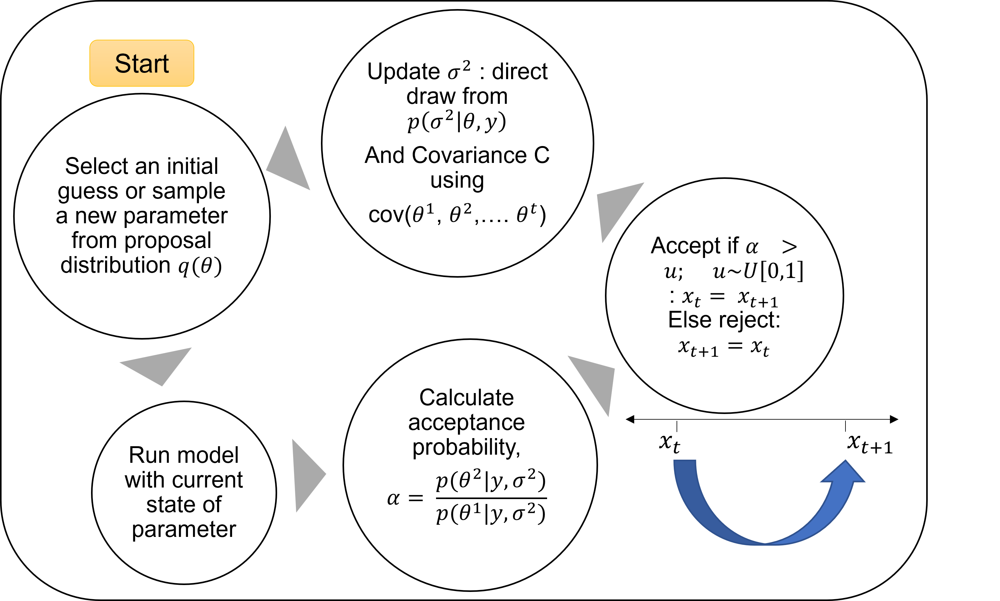

*Student seminar on 19th January, 2024, ICWaR*

*-Vivek, PhD candidate ICWaR*

                        
**Metropolis Hastings Algorithm for parameter estimation**

**Outline:**

a)  History of development of the algorithm

b)  Theoretical background

c)  Jupyter notebook with hands for parameter estimation

### **a)  History of development of the algorithm**

* 1949: Developed by Nicholas Metropolis, who also led the development of the first programmable super-computer MANIAC, speed of which allowed the MC method to be developed.
* The Monte Carlo (*the first MC*) method was developed to *simulate* the behaviour of neutrons in a fissile material in atomic bombs. [The Monte Carlo Method; Metropolis and Ulam 1949,](https://doi.org/10.1080/01621459.1949.10483310)
* 1970: Followed by W. Keith Hastings among others, in showed the true potential of the algorithm as a method to sample from high-dimensional probability distributions.
* Hastings generalized the algorithm to use with non-symmetrical distributions. Also introducing the proposal distribution as Markov chain (*the second MC*).
* 1990s, Gibbs sampling, a special case of the M-H algorithm became popular. Thus MCMC methods formally came into being.

Since then there have been numerous MCMC methods:
1. Rejection Sampling
2. Gibbs Sampling
3. Metropolis(-Hastings)
4. Slice Sampling
5. Stochastic Gradient Langevin Dynamics (SGLD)
6. Annealed Importance Sampling (AIS)
7. And more!

*Reference: A History of the Metropolis–Hastings Algorithm; DOI: 10.1198/0003130032413*


### **b) Theoretical background**
Let us have a non-linear (or linear) equation $f$ with 3 parameters, a, b & c.
Let us define the function $f$ first:
$$
\begin{aligned}
f  =  (\space) \cdot exp(-a) + b \cdot (\space) + c \\
y  =  f(x_1, x_2)
\end{aligned}
$$
And the parameters with the following space:

$$
\begin{aligned}
a \in [0,20] \\ 
b \in [0,1000] \\
c \in [0,50]
\end{aligned}
$$


* Now we see the possible number of parameter combinations here is: $20 \times 1000 \times 50 = 1 million$ parameter set possibilities.

* A fairly large number, maunal estimation will take a very long time.

* One may argue that brute force will also work

* One can use **Metropolis Hastings Algorithm**, to randomly sample from the complete parameter space and arrive at the best solution.

But wait! why won't the ordinary least squares method work here?

OLS assumes system of equations is *Linear*

Also, incidently for a linear system, the maximum likelihood estimator turns out to be the solution from OLS

### Before the algorithm, some revision...

### Bayesian data analysis

##### "Estimation of the posterior distribution of variable of interest from the data at hand"

Let our parameters be defined by a vetor, $\theta = [a,b,c]$


$$
\begin{aligned}
p(\theta|y)  =  \frac{p(y|\theta)}{p(y)} \\
\end{aligned}
$$

| p | probability |
|:--------:|:--------:|
| $$\theta$$ | state of parameters |
| $$y$$ | observed data |
| $$p(\theta)$$ | prior |
| $$p(y \lvert \theta)$$ | likelihood |
| $$p(y)$$ | Normalization |
| $$p(\theta \lvert y)$$ | posterior \✅|

### Metropolis Hastings Algorithm

1. Select a prior distribution for drawing out samples $p(\theta)$.

   - Choice of this prior should be careful as it can affect the convergence time of the algorithm

2. Start from an initial value (value does not matter), lets say $\theta_0$

3. Draw out a new sample of $\theta$ from the prior distribution, lets say $\theta_p$.

4. Calculate the posterior probability $p(\theta|y)$ for both $\theta_0$ and $\theta_p$

5. Find the ratio of posterior probabilities

$$\rho  =  \frac{p(\theta_p|y)}{p(\theta_0|y)}$$

6. Calculate the acceptance probability $\alpha$

   - $\rho \geq 1$ accept the new sample, $\theta = \theta_p$

   - $\rho \geq 1$ accept the new sample with probability $\alpha$ ($\theta = \theta_p$) and reject it with probability $1 - \alpha$ ($\theta = \theta_0$)

   - Where $\alpha$ is a random value generated from the uniform distribution ~ $U[0,1]$

   - This is why the method is random sampling!

7. Repeat steps 3 to 6 till error (RMSE or any other) is reduced to desireable value.
    - Repetetions make the method Monte Carlo!
    - With the assumption that more number of sampling, we will converge to the true distribution $p(\theta|x)$

### Choice of prior distribution $p(\theta)$

Among many available, one choice for the prior distribution to generate the new sample of $\theta$ can be using a Normal distribution with the mean equal to the current state of parameter vector and a suitable standard deviation.

$$
\begin{aligned}
\theta_p  =  N(\theta, \sigma^2)
\end{aligned}
$$

Thus here we see why the method is Markov method!

### Choice of the likelihood function $p(y \lvert \theta)$

Likelihood function should give a higher value for a better estimation and vice-versa

One choice for this 'better' metric can be the error between the simulated value and the true/observed.

Thus we can use the error as a likelihood funtion, as it turns out with the mathematics, it is given as:

$$
\begin{aligned}
p(y \lvert \theta, \sigma^2)  =  \frac{1}{(2 \pi  \sigma^2)^\frac{n}{2}} \exp(\frac{-SS_{\theta}}{2 \sigma^2}) \\
\\
SS_{\theta}  =  \sum_{i=1}^{n}(y_i - f_i(\theta))^2
\end{aligned}
$$

### Where is DRAM?
#### DRAM: Delayed Rejection Adaptive Metropolis

To summarise


### **c)  Jupyter notebook with hands for parameter estimation**
#### Continue to jupyter notebook pymcmc_para_est.ipynb


```python

```
